# 🎫 Ticket-Lab: 대규모 동시성 제어 티켓 예매 시스템

> 분산 환경에서의 동시성 제어와 이벤트 기반 아키텍처를 적용한 실시간 티켓 예매 플랫폼

[](https://www.oracle.com/java/)
[](https://spring.io/projects/spring-boot)
[](https://redis.io/)
[](https://kafka.apache.org/)

---

## 📋 목차
- [프로젝트 개요](#-프로젝트-개요)
- [핵심 기술 스택](#-핵심-기술-스택)
- [아키텍처](#-아키텍처)
- [동시성 제어 전략](#-동시성-제어-전략)
- [대기열 시스템](#-대기열-시스템)
- [이벤트 기반 아키텍처](#-이벤트-기반-아키텍처)
- [고민사항](#-고민사항)
- [API 문서](#-api-문서)
- [FAQ](#-faq)

---

## 🎯 프로젝트 개요

수만 명이 동시에 접속하는 티켓 예매 시스템에서 정해진 좌석만 정확히 판매하고 빠른 응답 속도를 유지하며 안정적으로 서비스하는 것을 목표했다.

해당 프로젝트는 도메인 특성을 고려하여 가장 중요한 목표를 다음 3가지로 정했다.

1. 데이터 정합성(+트랜잭션 일관성)
2. 멱등성 보장
3. 동시성 제어

### 핵심 과제

| 문제 | 해결 방법                    | 성과 |
|------|--------------------------|------|
| **동시성 이슈** | Redisson 분산 락 + Redis 캐싱 | 중복 예매 방지 |
| **DB 과부하** | 락 → 캐시 → DB| DB 부하 감소 |
| **트래픽 제어** | Redis ZSet 활용| Active User 100명 제한 |
| **응답 속도** | Kafka 비동기 이벤트 처리 Kafka| 응답시간 향상 및 결합도 제거 |

---

## 🛠 핵심 기술 스택

### Backend
- **Java 17**
- **Spring Boot 3**
- **Spring Data JPA**
- **MySQL 8.0**

### Infrastructure
- **Redis + Redisson** - 분산 락, 캐싱, 대기열
- **Apache Kafka** - 이벤트 기반 비동기 처리
- **Docker Compose** - 로컬 개발 환경

### Monitoring
- **Prometheus** - 메트릭 수집
- **Grafana** - 시각화

### AI
- **Gemini**
- **Claude Code** - 리팩토링 및 테스트
---

## 🏗 아키텍처

### 시스템 아키텍처


> Click Image 

#### 1. **Facade 패턴**
복잡한 인프라 계층(Redis, Redisson, Kafka)을 Application Layer에서 추상화하여 도메인 로직과 분리

#### 2. **Rich Domain Model**
비즈니스 로직을 엔티티 내부에 캡슐화 (예: `Seat.reserve()`)

#### 3. **Event-Driven Architecture**
Kafka를 통한 비동기 이벤트 처리로 메인 플로우와 부가 작업 분리

---

## 🔒 동시성 제어 전략


**Redisson**
- Pub/Sub 기반 대기
- RLock 인터페이스로 간편한 분산 락 구현
- 공정성 옵션 지원

---

## 🎫 대기열 시스템


### 주요 기능

**1. 대기열 관리**
- Redis SortedSet(ZSet)으로 FIFO 순서 보장
- 타임스탬프 기반 score로 공정한 순서 처리

**2. Active User 제한**
- 개별 키 + TTL 5분 방식
- 브라우저 종료 시 자동 정리

**3. Scheduler**
- 1초마다 100명씩 Active User로 이동
- MAX_ACTIVE_USER 100명 한도 체크

---

## 📨 이벤트 기반 아키텍처

### 문제: 동기 처리의 한계

```java
public String reserve() {
    // ... 예매 로직 ...
    emailService.sendConfirmation();
    smsService.sendNotification();
    statisticsService.update();
    return "SUCCESS";
}
```

**문제점:**
- 외부API(SMTP, 카카오톡 등) 서버 장애 시 예매도 실패

### 해결: Kafka 이벤트 기반

```java
// ✅ After: 비동기 이벤트 발행
public String reserve() {
    // ... 예매 로직 ...
    kafkaProducer.publish(event); // 밀리초 단위
    return "SUCCESS"; // 즉시 응답!
}

// 별도 Consumer에서 비동기 처리
@KafkaListener(topics = "reservation-events")
public void consume(ReservationEvent event) {
    emailService.send();    // 비동기
    smsService.send();       // 비동기
    statisticsService.update(); // 비동기
}
```

### Kafka 설정

**Producer:**
- `acks=all` - 모든 복제본 확인 (신뢰성 최우선)
- 재시도 3회
- Key: seatId (같은 좌석 이벤트 순서 보장)

**Consumer:**
- 수동 커밋 (At-least-once 보장)
- 처리 실패 시 자동 재시도
- Consumer Group: `ticket-reservation-group`

---


## 📖 API 문서

### 대기열 API

| Method | Endpoint | 설명 |
|--------|----------|------|
| POST | `/api/v1/queue/enter?userId={id}` | 대기열 진입 |
| GET | `/api/v1/queue/status?userId={id}` | 상태 확인 |
| DELETE | `/api/v1/queue?userId={id}` | 대기열 이탈 |

### 예매 API

| Method | Endpoint | 설명 |
|--------|----------|------|
| POST | `/api/v1/reservations/reserve` | 예매 진행 |
| POST | `/api/v1/reservations/cancel` | 예매 취소 |

---

## 🧪 부하 테스트

테스트는 **Claude Code**에 부하 테스트용 Agents를 설정하여 진행하였습니다.

### 1. 테스트 목표

* **동시성 제어**: 1,000명의 유저가 한정된 100개의 좌석을 두고 경쟁하는 상황 시뮬레이션
* **트래픽 밀집**: 시간에 따른 Score를 부여하여 1,000명의 트래픽이 한꺼번에 몰리는 상황 부여
* **프로세스 완결성**: 좌석 선점 후 결제까지 완료되어야 성공으로 처리하며, 이탈 시 좌석 점유 해제 검증
* **데이터 정합성**: 테스트 종료 후 DB 및 Redis의 상태가 실제 예매 결과와 일치하는지 Grafana로 최종 체크

### 2. 테스트 환경 및 시나리오

#### 📋 테스트 설정

| 항목 | 값 |
| --- | --- |
| **총 좌석 수** | 100개 |
| **총 유저 수** | 1,000명 |
| **Max Active Users** | 100명 → 200명 (순차 증가) |
| **결제 성공률** | 80% (사용자 변심/이탈 가정) |
| **결제 소요 시간** | 10초 |

#### 📈 예상 결과 (Metrics)

| 메트릭 | 예상 값 | 비고 |
| --- | --- | --- |
| **reservation_success** | 100 | 전 좌석 매진 |
| **reservation_failed** | 900 | 매진으로 인한 대기/실패 |
| **payment_success** | ~125 | 결제 시도 중 최종 성공 확률 반영 |
| **payment_failed** | ~25 | 결제 과정 중 이탈/실패 |

---

### 3. 테스트 진행 과정

**1️⃣ 대기열 인입 및 스케줄링**
테스트 시작과 동시에 **Redis Zset** 대기열에 1000명의 유저가 들어갔고, 큐 스케줄러를 통해 초당 100명씩 Active 상태로 전환되었다.

**2️⃣ 좌석 선점 및 캐싱**
선점이 되었거나, 예매이 완료된 좌석에 대해서는 seat의 상태를 캐싱하여 저장해두어서 다른 유저가 접근하지 못하게 했다.

<table>
<tr>
<td align="center"><b>Redis 좌석 상태 (Seat Status)</b></td>
<td align="center"><b>Redis 대기열 (Waiting Queue)</b></td>
</tr>
<tr>
<td align="center">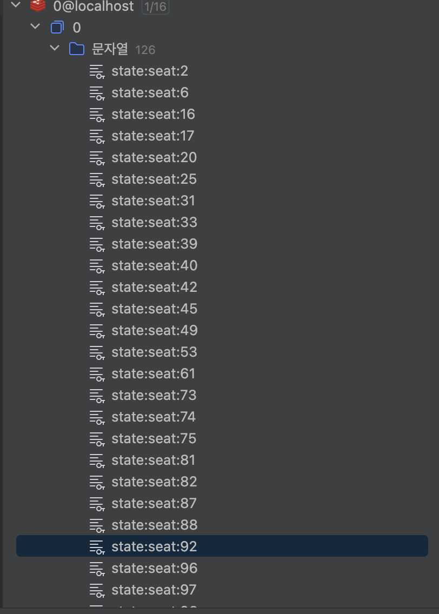</td>
<td align="center">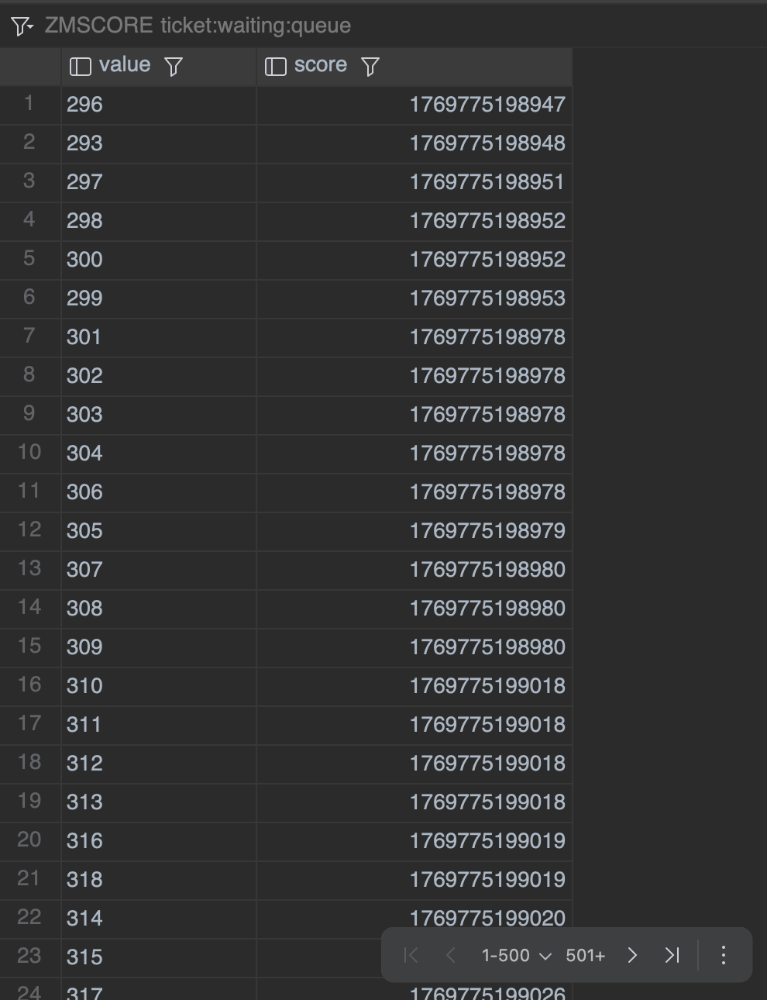</td>
</tr>
</table>

**3️⃣ 실시간 모니터링 (Grafana)**
대기열에서 성공적으로 전환된 유저들의 예매 성공/실패 지표를 실시간으로 모니터링했고, 시간이 지남에 따라 Success 지표가 안정적으로 상승하는 것을 확인했다.

<p align="center">

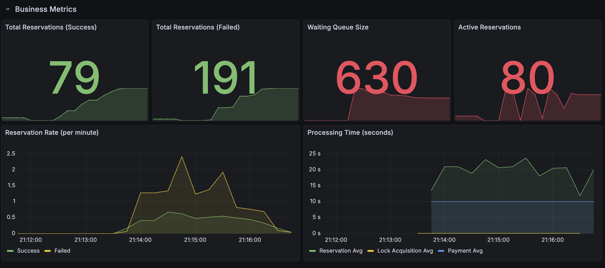


<sub><b>그라파나 대시보드: 예매 성공 지표의 점진적 상승 확인</b></sub>
</p>

**4️⃣ Redis 캐싱 확인**
자리 선점 및 예매이 완료된 좌석들이 정상적으로 Redis 캐시에 기록되는 것을 확인했다.

<p align="center">
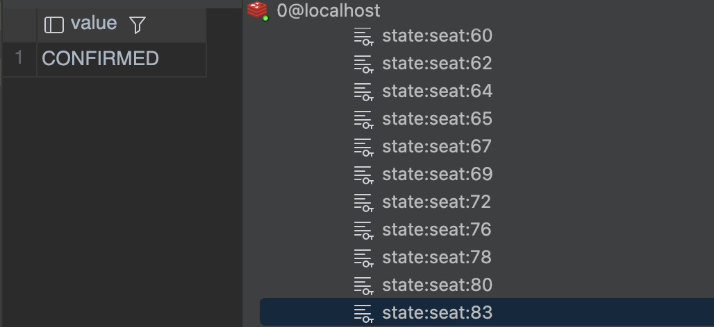
</p>

<sub><b>CONFIMRED : 예매이 완료된 좌석 (다른유저 좌석 접근 불가)</b></sub>

---

### 4. 트러블슈팅: 1차 테스트 실패

#### 문제 발생

1차 테스트 결과, 예상했던 성공 100건에 못 미치는 **79건**에서 멈추는 현상이 발생했다. 또한 모든 유저가 Active 큐에 진입하지 못하고 고작 270명만 진입하는 문제가 발생했다.

<p align="center">
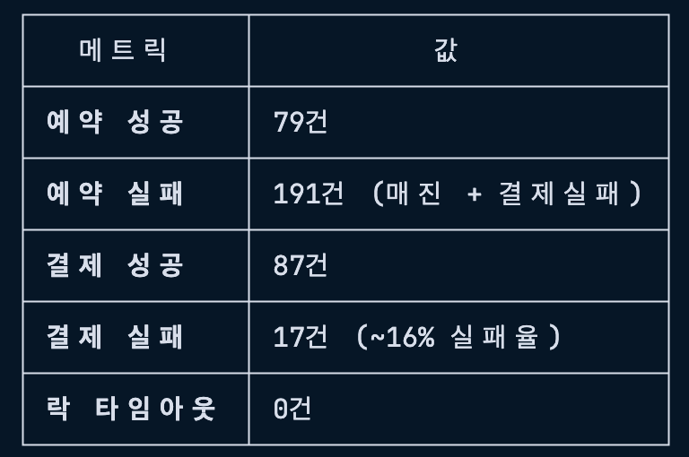
</p>

> **원인 분석**
> * **스케줄러**: Score 상위 유저부터 Active로 전환 (userId 7, 55, 45...)
> * **테스트 코드**: userId 1번부터 순차적으로 요청을 보냄
> * **결과**: 아직 Active 권한을 얻지 못한 유저들이 요청을 보내면서 403 Forbidden 에러 발생. 결과적으로 270명만 정상 진입함.
>  .
> 

#### ✅ 해결 방법

각 유저가 자신의 상태가 **Active**가 될 때까지 대기한 후, Active 권한을 획득했을 때 예매을 시도하도록 테스트 코드를 수정했다. 즉, 모든 유저가 대기 후 모두 Active 큐에 들어갈 수 있게 설정했다.

---

### 5. 최종 테스트 결과 - 성공 

코드 수정 후 재테스트를 진행한 결과, 모든 지표가 예상치에 부합하며 성공적으로 종료되었다.

<p align="center">
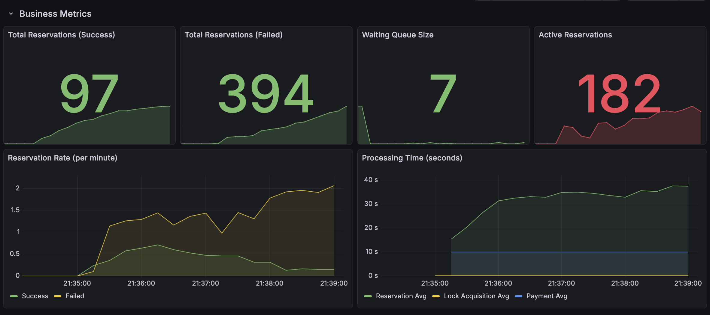
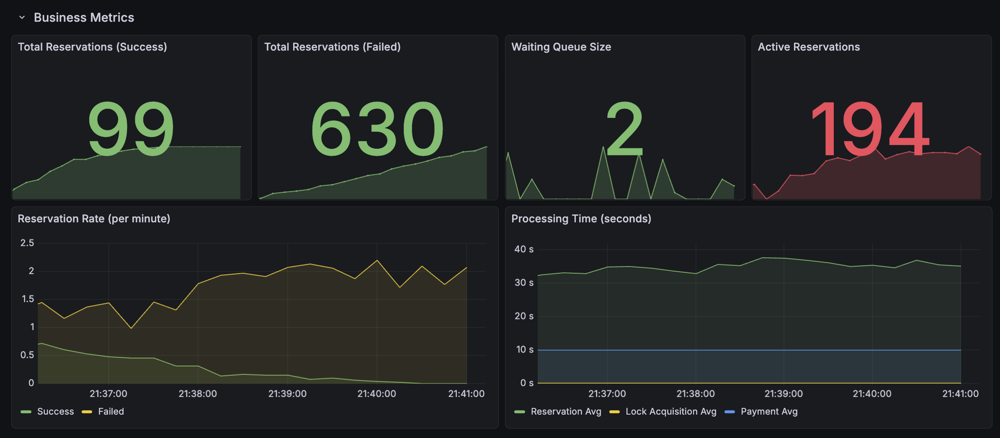
</p>

* **최종 상태**: 티켓 100개 전량 매진
* **유저 흐름**: 대기 → 선점 → 예매 프로세스가 유기적으로 작동함을 확인

<p align="center">
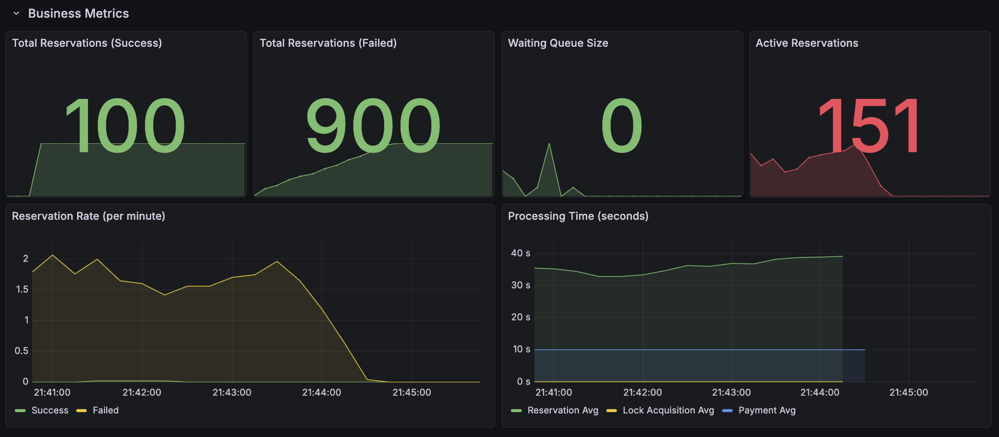
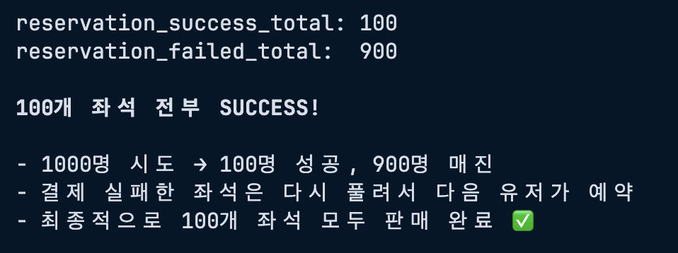
</p>

#### 💾 DB 정합성 확인

테스트 후, DB 내의 좌석 상태와 예매 내역이 불일치 없이 정확하게 반영됨을 확인하였따.

<table>
<tr>
<td align="center" width="50%">
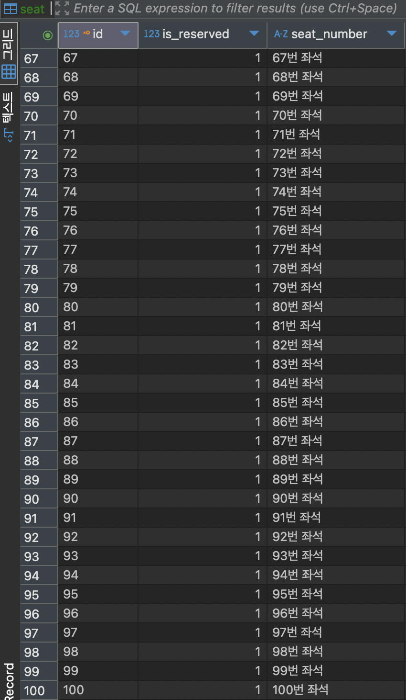
<sub><b>좌석(Seat) DB 결과</b></sub>
</td>
<td align="center" width="50%">
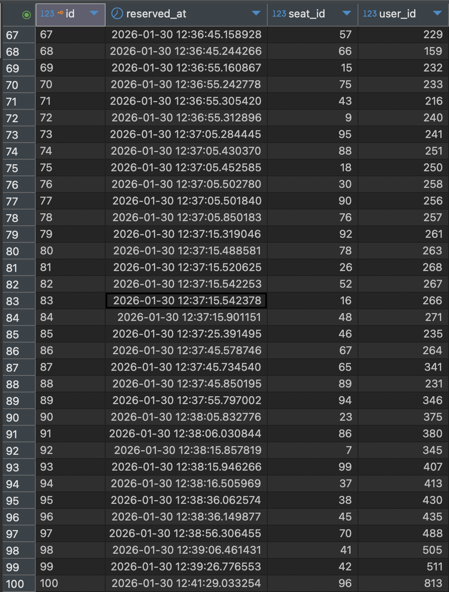
<sub><b>예매(Reservation) DB 결과</b></sub>
</td>
</tr>
</table>

### 6. 테스트 후기

* **Redis를 이용한 DB 부하 분산 효과**
1,000명의 유저가 동시에 몰렸음에도 불구하고, 좌석 상태를 Redis 캐싱으로 처리하여 DB의 부하를 최소화할 수 있었다.

<br />

* **예외 상황에 대한 전략**
결제 중 이탈(20%) 시나리오를 통해 좌석 점유가 무한정 유지되지 않고 정상적으로 해제되어 다음 유저에게 기회가 돌아가는 것을 확인했다. 다만, 테스트를 위해 임의로 넣은 수치인 만큼 실제 환경에서의 TTL 전략과, 페이지 이탈 시의 전략에 대한 고민이 필요하다.


---

## 🤔 고민사항

### 1. Redis TTL 시간 설정 근거

- 결제시간을 얼만큼 줘야할까?

```java
redisTemplate.opsForValue().set(key, "SELECTED", 5, TimeUnit.MINUTES);
```
- 결제 시뮬레이션 10초 + 여유 시간
- 너무 짧으면 정상 예매도 만료 or 심각하면 중복결제 가능
- 너무 길면 실패한 락이 오래 남아서 기회비용 날림

### 2. Active User를 Set → 개별 키로 변경

**AS-IS:**
```redis
SADD ticket:active:users 100 101 102
# TTL 설정 불가 → 메모리 누수
```

**TO-BE**
```redis
SET ticket:active:users:100 "1" EX 300
SET ticket:active:users:101 "1" EX 300
# 각 키마다 TTL 자동 적용
```

**효과:**
- 브라우저 종료 시 5분 후 자동 제거
- Scheduler 장애와 무관하게 동작
- Redis 기본 기능만 활용 (간단)

**다만, 키가 너무 많이 생겼을 때 문제가 있을 수 있는지?**


### 3. 휘발성인 Redis는 어떤식으로 관리해야할까?
1. DB에 직접 다 저장하기에는 데이터가 너무 많이 생길 것 같음
2. 뭔가 정상적으로 이벤트가 모두 종료된 후라면, 휘발되어도 크게 문제가 되지 않을것 같긴함...
   
### 4. 공연/스포츠 마다 미리 트래픽을 예상하는 방법?

- 과거 데이터 분석
- 예상이 힘들 때는? 그냥 조금이라도 예상되면 무조건 여유롭게 준비하는게 나을까?

### 5. 개인적인 생각 : 어떤일이 있어도 Redis만큼은 죽어선 안된다.
- 고가용성 관련 대비 - 단일 노드 X (트래픽 분산)
- APP과 Redis 사이 Load Balancer 활용 (HAProxy, ALB 등)
- 페일오버 전략 - 레플리케이션
  