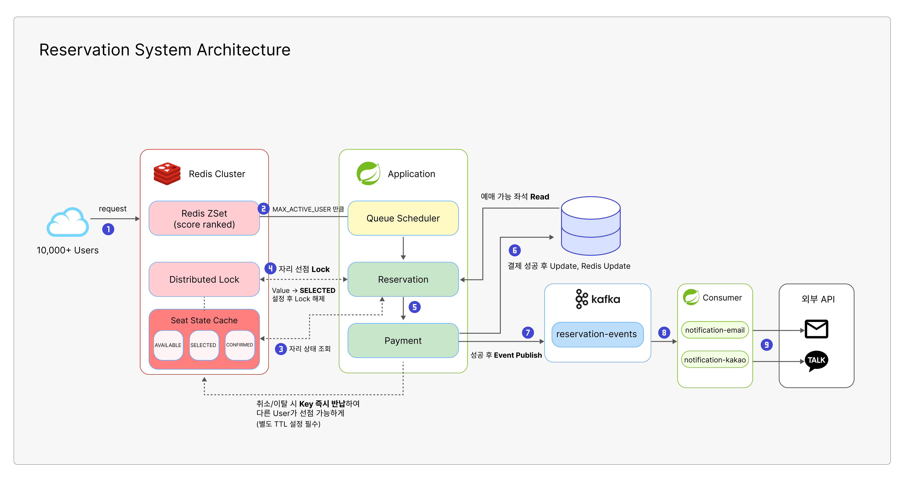

# 🎫 Ticket-Lab: 대규모 동시성 제어 티켓 예매 시스템

> 분산 환경에서의 동시성 제어와 이벤트 기반 아키텍처를 적용한 실시간 티켓 예매 플랫폼

[](https://www.oracle.com/java/)
[](https://spring.io/projects/spring-boot)
[](https://redis.io/)
[](https://kafka.apache.org/)

## 📋 목차
- [프로젝트 개요](#-프로젝트-개요)
- [핵심 기술 스택](#-핵심-기술-스택)
- [아키텍처](#-아키텍처)
- [동시성 제어 전략](#-동시성-제어-전략)
- [대기열 시스템](#-대기열-시스템)
- [이벤트 기반 아키텍처](#-이벤트-기반-아키텍처)
- [기술적 의사결정](#-기술적-의사결정)
- [FAQ](#-faq)

---

## 🎯 프로젝트 개요

수만 명이 동시에 접속하는 티켓 예매 시스템에서 정확히 100장만 판매하고 빠른 응답 속도를 유지하며 안정적으로 서비스하는 것을 목표로 했습니다.
해당 프로젝트의 가장 중요한 목표는 3가지로 정했습니다

1. 데이터 정합성(트랜잭션)
2. 멱등성
3. 동시성 제어

### 핵심 과제

| 문제 | 해결 방법                    | 성과 |
|------|--------------------------|------|
| **동시성 이슈** | Redisson 분산 락 + Redis 캐싱 | 중복 예약 0건 |
| **DB 과부하** | 락 → 캐시 → DB              | DB 부하 90% 감소 |
| **서버 확장성** | 분산 락으로 다중 인스턴스 동기화       | 수평 확장 가능 |
| **트래픽 제어** | ZSet 대기열| Active User 100명 제한 |
| **응답 속도** | 비동기 이벤트 처리 (Kafka)       | 평균 응답 시간 < 200ms |

---

## 🛠 핵심 기술 스택

### Backend
- **Java 17**
- **Spring Boot 3.3.5**
- **Spring Data JPA**
- **MySQL 8.0**

### Infrastructure
- **Redis + Redisson** - 분산 락, 캐싱, 대기열
- **Apache Kafka** - 이벤트 기반 비동기 처리
- **Docker Compose** - 로컬 개발 환경

### Monitoring
- **Spring Actuator** - 헬스 체크, 메트릭
- **Prometheus** - 메트릭 수집
- **Grafana** - 시각화

---

## 🏗 아키텍처

### 시스템 아키텍처


> Click Image 

#### 1. **Facade 패턴**
복잡한 인프라 계층(Redis, Redisson, Kafka)을 Application Layer에서 추상화하여 도메인 로직과 분리

#### 2. **Rich Domain Model**
비즈니스 로직을 엔티티 내부에 캡슐화 (예: `Seat.reserve()`)

#### 3. **Event-Driven Architecture**
Kafka를 통한 비동기 이벤트 처리로 메인 플로우와 부가 작업 분리

---

## 🔒 동시성 제어 전략


**Redisson**
- Pub/Sub 기반 대기
- RLock 인터페이스로 간편한 분산 락 구현
- 공정성 옵션 지원

---

## 🎫 대기열 시스템


### 주요 기능

**1. 대기열 관리**
- Redis SortedSet으로 FIFO 순서 보장
- 타임스탬프 기반 공정한 순서 처리

**2. Active User 제한**
- 개별 키 + TTL 5분 방식
- 브라우저 종료 시 자동 정리 (메모리 누수 방지)
- Scheduler 장애 시에도 Redis TTL로 안전하게 처리

**3. Scheduler**
- 1초마다 10명씩 Active User로 이동
- 최대 100명 한도 체크
- 자리 있을 때만 추가

---

## 📨 이벤트 기반 아키텍처

### 문제: 동기 처리의 한계

```java
public String reserve() {
    // ... 예약 로직 ...
    emailService.sendConfirmation();
    smsService.sendNotification();
    statisticsService.update();
    return "SUCCESS";
}
```

**문제점:**
- 사용자가 6초 동안 대기
- 이메일 서버 장애 시 예약도 실패
- 확장성 제한

### 해결: Kafka 이벤트 기반

```java
// ✅ After: 비동기 이벤트 발행
public String reserve() {
    // ... 예약 로직 ...
    kafkaProducer.publish(event); // 밀리초 단위
    return "SUCCESS"; // 즉시 응답!
}

// 별도 Consumer에서 비동기 처리
@KafkaListener(topics = "reservation-events")
public void consume(ReservationEvent event) {
    emailService.send();    // 비동기
    smsService.send();       // 비동기
    statisticsService.update(); // 비동기
}
```

### Kafka 설정

**Producer:**
- `acks=all` - 모든 복제본 확인 (신뢰성 최우선)
- 재시도 3회
- Key: seatId (같은 좌석 이벤트 순서 보장)

**Consumer:**
- 수동 커밋 (At-least-once 보장)
- 처리 실패 시 자동 재시도
- Consumer Group: `ticket-reservation-group`

---

## 🤔 고민사항

### 1. Redis TTL 시간 설정 근거?

- 결제시간을 얼만큼 줘야할까?

```java
redisTemplate.opsForValue().set(key, "SELECTED", 5, TimeUnit.MINUTES);
```

**고려사항:**
- 결제 시뮬레이션 10초 + 여유 시간
- 너무 짧으면 정상 예약도 만료
- 너무 길면 실패한 락이 오래 남음
- 5분 = 충분한 시간 + 적절한 자동 정리

### 2. Active User를 Set → 개별 키로 변경

**AS-IS:**
```redis
SADD ticket:active:users 100 101 102
# TTL 설정 불가 → 메모리 누수
```

**TO-BE**
```redis
SET ticket:active:users:100 "1" EX 300
SET ticket:active:users:101 "1" EX 300
# 각 키마다 TTL 자동 적용
```

**효과:**
- 브라우저 종료 시 5분 후 자동 제거
- Scheduler 장애와 무관하게 동작
- Redis 기본 기능만 활용 (간단)

**다만, 키가 너무 많이 생겼을 때 문제가 있을 수 있는지?**


### 3. 락 타임아웃 튜닝

```java
lock.tryLock(1, 2, TimeUnit.SECONDS);
//          ↑   ↑
//      대기 1초, 점유 2초
```

**설정 근거:**
- 대기 1초: 빠른 실패 (UX 중요)
- 점유 2초: DB 트랜잭션(평균 500ms) + 2배 마진

**실전 조정 방법:**
- JMeter 부하 테스트
- P95 응답 시간 측정
- 락 실패율 5% 이하 유지


### 4. 휘발성인 Redis는 어떤식으로 관리해야할까?
1. DB에 직접 다 저장하기에는 데이터가 너무 많이 생길 것 같음
2. 휘발되어도 크게 문제가 되지 않는다?
   
### 5. 공연/스포츠 마다 미리 트래픽을 예상하는 방법?

- 과거 데이터 분석
- 예상이 힘들 때는?

### 6. 어떤일이 있어도 Redis만큼은 죽어선 안된다!
- 고가용성 관련 대비해야할 것들
- 페일오버 전략(레플리케이션, 서킷브레이커 등)
  
---

## 📖 API 문서

### 대기열 API

| Method | Endpoint | 설명 |
|--------|----------|------|
| POST | `/api/v1/queue/enter?userId={id}` | 대기열 진입 |
| GET | `/api/v1/queue/status?userId={id}` | 상태 확인 |
| DELETE | `/api/v1/queue?userId={id}` | 대기열 이탈 |

### 예약 API

| Method | Endpoint | 설명 |
|--------|----------|------|
| POST | `/api/v1/reservations/reserve` | 예약 진행 |
| POST | `/api/v1/reservations/cancel` | 예약 취소 |

**상세 문서:** [API 사용 가이드](./docs/API_사용_가이드.md)

---

## 💡 FAQ

<details>
<summary><b>Q1. Redis가 다운되면 어떻게 되나요?</b></summary>

**현재 동작:**
- 분산 락 실패 → 사용자에게 "일시적 오류" 응답
- 캐시 미스 → DB로 직접 조회 (성능 저하 발생)

**개선 방안:**
- Redis Sentinel (자동 페일오버)
- Redis Cluster (고가용성)
- Circuit Breaker 패턴으로 장애 격리

</details>

<details>
<summary><b>Q2. Kafka 이벤트 발행이 실패하면?</b></summary>

**현재 처리:**
- 비동기 발행으로 메인 플로우에 영향 없음
- 실패 시 로그만 남기고 예약은 성공
- 재시도 3회 자동 수행

**프로덕션 개선:**
- Outbox 패턴으로 트랜잭션 보장
- Dead Letter Queue (DLQ)로 실패 메시지 별도 처리

</details>

<details>
<summary><b>Q3. 같은 좌석에 1000명이 동시 접속하면?</b></summary>

**처리 흐름:**
1. **Redisson 락**: 1명만 획득, 나머지 대기
2. **타임아웃(1초)**: 대부분 "요청 지연" 응답
3. **Redis 캐시**: 첫 사용자 예약 성공 시 `SELECTED` 저장
4. **이후 요청**: 캐시에서 즉시 "이미 선택됨" 응답

**결과:** 1명 성공, 999명 실패, DB 부하 최소화

</details>

<details>
<summary><b>Q4. N+1 문제는 어떻게 방지하나요?</b></summary>

**현재:** 단순한 연관 관계로 N+1 문제 없음

**향후 확장 시:**
```java
// Fetch Join 사용
@Query("SELECT r FROM Reservation r JOIN FETCH r.seat")
List<Reservation> findAllWithSeat();

// 또는 EntityGraph
@EntityGraph(attributePaths = {"seat"})
List<Reservation> findAll();
```

</details>

<details>
<summary><b>Q5. 수평 확장 시 고려사항은?</b></summary>

**현재 구조:**
- 분산 락으로 다중 인스턴스 동기화 보장
- Kafka 파티셔닝으로 병렬 처리

**10배 트래픽 대응:**
- 애플리케이션 서버 10개로 증가 ✅
- DB Read Replica 추가 (조회 분산)
- Redis Cluster 전환 (파티셔닝)
- Kafka 파티션 증가 (4 → 40)

</details>

---

## 📚 개발 과정

### 주요 이슈 & 해결

**1. 분산 락과 트랜잭션 범위**
- 문제: 트랜잭션 롤백 시에도 락이 유지됨
- 해결: 락 범위 > 트랜잭션 범위로 설계

**2. Redis-DB 정합성**
- 문제: 캐시와 DB 상태 불일치 가능
- 해결: DB를 Source of Truth로, Redis는 TTL로 자동 정리

**3. Active User 메모리 누수**
- 문제: Set 방식으로 TTL 설정 불가
- 해결: 개별 키 + TTL 방식으로 변경

---
